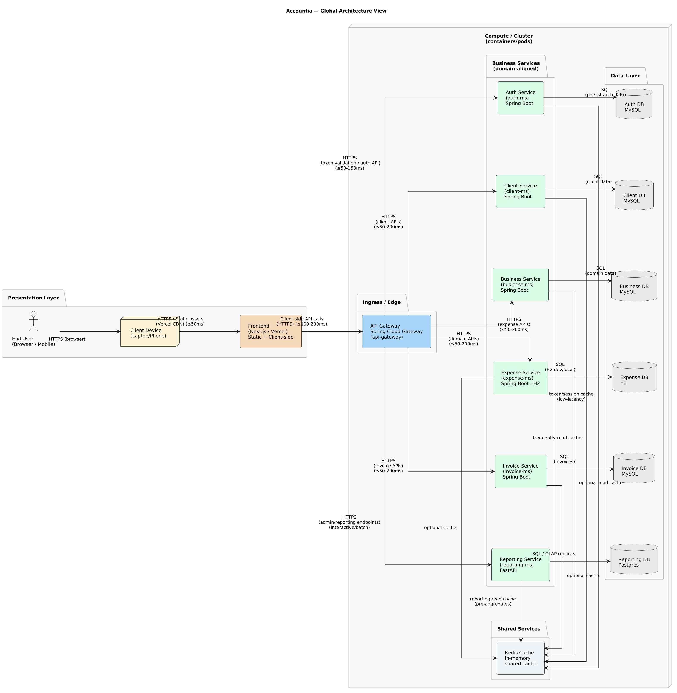

# Accountia

A multi-tenant SaaS platform for financial management built with microservices architecture.

## Architecture Overview

<p align="center">
  
</p>

## Tech Stack

| Component | Technology |
|-----------|------------|
| **API Gateway** | Spring Cloud Gateway (Java 21) |
| **Microservices** | Spring Boot 3.x (Java 21) |
| **Reporting Service** | FastAPI (Python 3.11) |
| **Authentication** | Keycloak 24.0 (OAuth2/OIDC) |
| **Databases** | MySQL 8.0, PostgreSQL 15 |
| **Message Broker** | RabbitMQ 3.12 |
| **Caching** | Redis 7 |
| **Orchestration** | Docker Compose, Kubernetes (Kustomize) |

## Project Structure

```bash
accountia/
├── api-gateway/          # Spring Cloud Gateway - JWT validation & routing
├── auth-ms/              # Authentication microservice
├── business-ms/          # Business management microservice
├── client-ms/            # Client management microservice
├── expense-ms/           # Expense tracking microservice
├── invoice-ms/           # Invoice management microservice
├── reporting-ms/         # Reporting service (FastAPI/Python)
├── keycloak/             # Keycloak realm configuration
├── k8s/                  # Kubernetes manifests (Kustomize)
├── docker-compose.yml    # Local development orchestration
└── Makefile              # Build and run shortcuts
```

## API Routes

All routes are exposed through the API Gateway at `http://localhost:8080`:

| Service | Route | Description |
|---------|-------|-------------|
| Auth MS | `/api/auth/**` | Authentication (login, register, password reset) |
| Business MS | `/api/business/**` | Business entity management |
| Client MS | `/api/client/**` | Client management |
| Invoice MS | `/api/invoices/**` | Invoice CRUD operations |
| Expense MS | `/api/expense/**` | Expense tracking |
| Reporting MS | `/api/reporting/**` | Analytics and reports |

## Getting Started

### Prerequisites

- Docker & Docker Compose
- Java 21 (for local development)
- Python 3.11 (for reporting-ms development)
- Maven 3.9+

### Quick Start

```bash
# Build all services
make build

# Start all services
make up

# View logs
make logs

# Stop all services
make down
```

### Service URLs (Local Development)

| Service | URL |
|---------|-----|
| API Gateway | http://localhost:8080 |
| Keycloak Admin | http://localhost:8180 |
| RabbitMQ Management | http://localhost:15672 |

### Environment Variables

Create a `.env` file in the root directory:

```env
# MySQL
MYSQL_ROOT_PASSWORD=root
MYSQL_DATABASE=accountia
MYSQL_USER=accountia
MYSQL_PASSWORD=accountia

# PostgreSQL (Reporting & Keycloak)
POSTGRES_DB=accountia_reporting
POSTGRES_USER=accountia
POSTGRES_PASSWORD=accountia

# RabbitMQ
RABBITMQ_USERNAME=guest
RABBITMQ_PASSWORD=guest

# Keycloak
KEYCLOAK_ADMIN=admin
KEYCLOAK_ADMIN_PASSWORD=admin

# JWT
JWT_SECRET=changeitchangeitchangeitchangeit
```

## Kubernetes Deployment

The `k8s/` directory contains Kustomize manifests for Kubernetes deployment:

```bash
# Preview the generated manifests
kubectl kustomize k8s/

# Apply to cluster
kubectl apply -k k8s/
```

### K8s Structure

```bash
k8s/
├── kustomization.yaml    # Main Kustomize configuration
├── base/                 # Namespace, ConfigMaps, Secrets
├── infrastructure/       # MySQL, PostgreSQL, Redis, RabbitMQ, Keycloak
└── services/             # API Gateway and microservices
```

## Development

### Building Individual Services

```bash
# Java services (from service directory)
./mvnw clean package -DskipTests

# Python reporting service
cd reporting-ms
pip install -r requirements.txt
uvicorn main:app --reload
```

### Running Tests

```bash
# Java services
./mvnw test

# Python reporting service
pytest
```

## License

This project is licensed under the [GNU General Public License v3.0](LICENSE).
